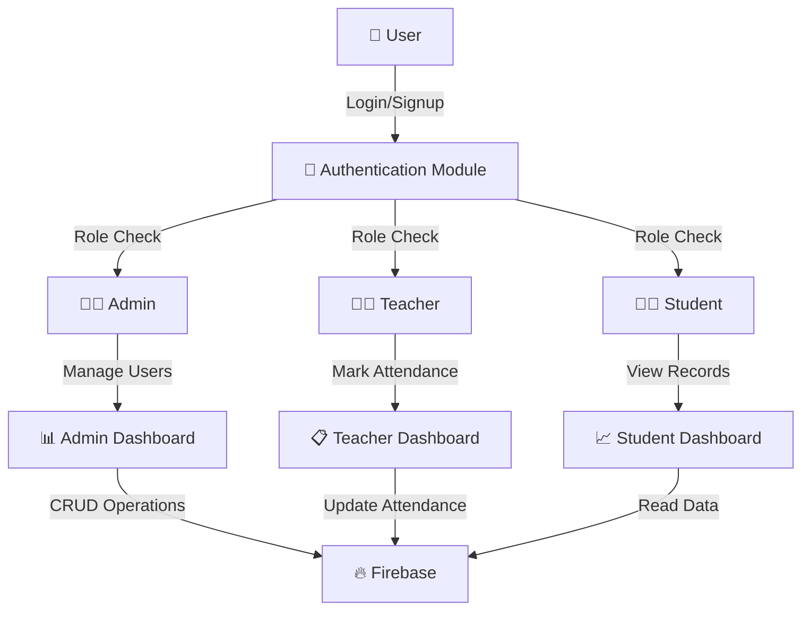
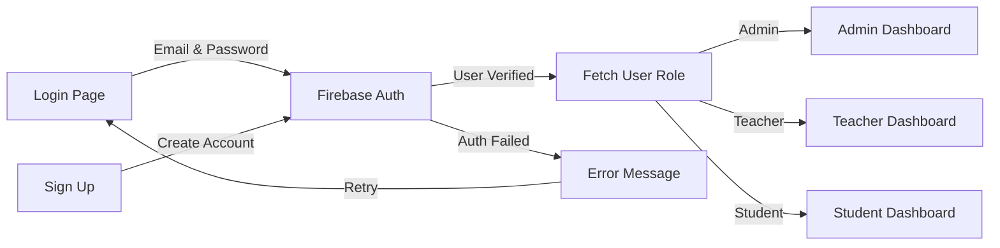
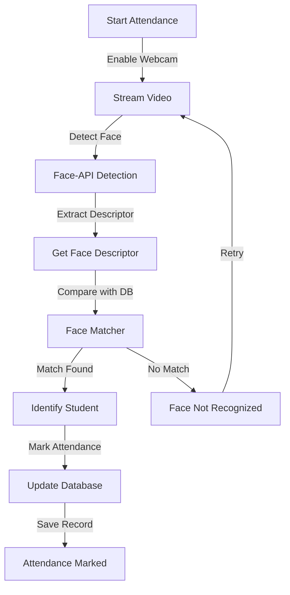

# 📚 Attendify - Smart Attendance Management System

A comprehensive, enterprise-grade attendance management system built with **React**, **TypeScript**, **Firebase**, and **Face Recognition** technology. Attendify streamlines attendance tracking with three distinct user roles: Admin, Teacher, and Student.

---

## 🎯 Features

- ✅ **Multi-role Authentication** (Admin, Teacher, Student)
- ✅ **Face Recognition** using Face-API.js for automated attendance
- ✅ **Real-time Attendance Tracking** with Firestore
- ✅ **Student Management** - Create, update, and manage student records
- ✅ **Teacher Dashboard** - Mark attendance and manage classes
- ✅ **Admin Dashboard** - Overview of all students, teachers, and attendance
- ✅ **Class Management** - Organize students into classes
- ✅ **Responsive UI** - Mobile-friendly design with Tailwind CSS
- ✅ **Attendance Statistics** - Present, Absent, Leave tracking

---

## 📊 System Architecture



---

## 🔐 Authentication Flow



---

## 👥 User Roles & Permissions

### 1. **Admin** 👨‍💼
- Full system access
- Manage all students, teachers, and classes
- View system-wide attendance reports
- Create and update class records
- Monitor all user activities

### 2. **Teacher** 👨‍🏫
- Mark attendance for assigned classes
- Manage assigned student records
- View class-specific attendance reports
- Upload face recognition data
- Track attendance history

### 3. **Student** 👨‍🎓
- View personal attendance records
- Check attendance statistics
- View class information
- Access personal profile

---

## 📦 Project Structure

```
src/
├── firebase/                    # Firebase integration
│   ├── firebaseUtils.ts        # Core Firebase operations
│   ├── studentUtils.ts         # Student CRUD operations
│   ├── teachersUtils.ts        # Teacher CRUD operations
│   ├── adminUtils.ts           # Admin CRUD operations
│   ├── AttendanceUtils.ts      # Attendance management
│   └── interfaces/
│       └── user.interface.ts   # Data models
├── services/
│   └── face-api.service.ts     # Face recognition service
├── components/
│   ├── layout/                 # Layout components
│   ├── modals/                 # Modal dialogs
│   ├── forms/                  # Form components
│   └── charts/                 # Chart components
├── features/
│   ├── auth/                   # Authentication feature
│   ├── dashboard/              # Dashboard layouts
│   └── profile/                # Profile management
├── pages/                      # Route pages
├── constants/                  # App constants
└── types/                      # TypeScript types
```

---

## 🔧 Core Services & Utilities

### 1. **Firebase Utils** (`firebaseUtils.ts`)
Core Firestore operations for database interactions.

```typescript
// Authentication
export async function login(email: string, password: string)
export async function signup(email: string, password: string)
export async function logout()
export async function resetPassword(email: string)

// Firestore CRUD
export const addDocument<T>(collectionName: string, data: T)
export const getDocument(collectionName: string, docId: string)
export const updateDocument<T>(collectionName: string, docId: string, data: T)
export const deleteDocument(collectionName: string, docId: string)
export const getCollection(collectionName: string)

// Advanced Queries
export async function queryCollection(collectionName: string, field: string, value: FieldValue, op: WhereFilterOp)
export const buildQuery(collectionName: string, filters: [], order?: {}, limitCount?: number)
```

---

### 2. **Student Utils** (`studentUtils.ts`)

```typescript
// Get Operations
export const getStudentById(studentId: string): Promise<Student | null>
export const getAllStudents(): Promise<Student[]>
export const getStudentsInClass(classId: string): Promise<Student[]>

// Create Operations
export const addStudent(studentData: Partial<Student>): Promise<void>

// Student Management
export const safeGetDocumentData<T>(collectionName: string, docId: string)
```

**Data Structure:**
```typescript
interface Student {
  id: string
  userName: string
  email: string
  createdAt: string
  updatedAt: string
  role: 'student'
  classes: string[]           // Array of class IDs
  classId: string             // Primary class ID
  rollNo: number
  profilePictureUrl?: string
  lastLogin?: string
  isActive: boolean
  settings?: { theme: 'light' | 'dark', notifications: boolean }
}
```

---

### 3. **Teacher Utils** (`teachersUtils.ts`)

```typescript
// Get Operations
export const getTeacherById(teacherId: string): Promise<Teacher | null>
export const getAllTeachers(): Promise<Teacher[]>
export const getTeacherClasses(teacherId: string, classes: Teacher['classes']): Promise<Class[]>

// Teacher Specific Operations
export const updateTeacherClasses(teacherId: string, classIds: string[])
```

**Data Structure:**
```typescript
interface Teacher {
  id: string
  userName: string
  email: string
  createdAt?: string
  updatedAt?: string
  role: 'teacher'
  classes: {
    id: string
    isAttendanceMarkedForToday: boolean
    completed: boolean
  }[]
  subject: string
  profilePictureUrl?: string
  lastLogin?: string
  isActive: boolean
}
```

---

### 4. **Admin Utils** (`adminUtils.ts`)

```typescript
// Get Operations
export const getAdminById(adminId: string): Promise<Admin | null>
export const getAllClasses(): Promise<Class[]>

// Class Management
export const getClassesByTeacher(teacherId: string): Promise<Class[]>
export const createClass(classData: Partial<Class>): Promise<void>
```

**Data Structures:**
```typescript
interface Admin {
  id: string
  userName: string
  email: string
  createdAt: string
  updatedAt: string
  role: 'admin'
  profilePictureUrl?: string
  isActive: boolean
}

interface Class {
  id: string
  className: string
  teacherId: string
  students: string[]
}
```

---

### 5. **Attendance Utils** (`AttendanceUtils.ts`)

```typescript
// Get Attendance Records
export const getAllAttendance(): Promise<AttendanceRecord[]>
export const getAllAttendanceForStudent(studentId: string): Promise<AttendanceRecord[]>
export const getAttendanceForClassOnDate(classId: string, date: number): Promise<AttendanceRecord[]>
export const getAttendanceForStudentOnDate(studentId: string, date: string): Promise<AttendanceRecord[]>

// Mark Attendance
export const markAttendanceForStudent(studentId: string, date: string, status: 'Present' | 'Absent' | 'Leave')
export const markBulkAttendance(attendanceRecords: AttendanceRecord[]): Promise<void>
```

**Data Structure:**
```typescript
interface AttendanceRecord {
  studentId: string
  date: string                // Format: "2025-10-27"
  status: 'Present' | 'Absent' | 'Leave'
  classId: string
}
```

---

## 🎯 Face Recognition Service

### Face API Service (`face-api.service.ts`)

The face recognition module uses **face-api.js** (TensorFlow.js-based) for accurate face detection, landmark detection, and recognition.

```typescript
// Load pre-trained models
export async function loadModels(modelPath = '/models')

// Load student face descriptors
export async function loadLabeledDescriptors(
  students: { id: string, name: string }[],
  bucketUrl: string
): Promise<LabeledDescriptorMap>

// Create face matcher for recognition
export function createFaceMatcher(descriptors: LabeledFaceDescriptors[], threshold: number)

// Detect faces in image/video
export async function detectFace(input: HTMLImageElement | HTMLVideoElement)

// Get face descriptor for comparison
export async function getFaceDescriptor(face: HTMLCanvasElement): Promise<Float32Array>
```

### Models Included:
- **SSD MobileNetv1** - Fast face detection
- **Face Landmark 68** - Facial feature detection
- **Face Recognition Net** - Generate face descriptors for matching
- **Tiny Face Detector** - Lightweight detection option
- **Face Expression Model** - Emotion detection
- **Age & Gender Model** - Demographics detection

### Attendance Method - Face Recognition Flow



---

## 🔄 Complete Attendance Marking Workflow

```mermaid
graph LR
    A["Teacher Dashboard"] -->|Select Class| B["Get Class Students"]
    B -->|Load Student Data| C["Load Face Models"]
    C -->|Enable Webcam| D["Start Recognition"]
    D -->|Detect Face| E["Extract Face Data"]
    E -->|Match with DB| F["Identify Student"]
    F -->|Auto Mark| G["Update Attendance"]
    G -->|Sync Firebase| H["Save to Firestore"]
    H -->|Refresh UI| I["Show Marked Status"]
```



---

## 🗄️ Firebase Collections

### Collections Structure:

```
Firestore Database
├── students/
│   └── {studentId}
│       ├── id: string
│       ├── userName: string
│       ├── email: string
│       ├── classId: string
│       ├── classes: string[]
│       ├── rollNo: number
│       └── ... (other fields)
│
├── teachers/
│   └── {teacherId}
│       ├── id: string
│       ├── userName: string
│       ├── email: string
│       ├── classes: { id, isAttendanceMarkedForToday, completed }[]
│       ├── subject: string
│       └── ... (other fields)
│
├── classes/
│   └── {classId}
│       ├── id: string
│       ├── className: string
│       ├── teacherId: string
│       └── students: string[]
│
├── attendance/
│   └── {recordId}
│       ├── studentId: string
│       ├── classId: string
│       ├── date: string (YYYY-MM-DD)
│       └── status: 'Present' | 'Absent' | 'Leave'
│
└── admins/
    └── {adminId}
        ├── id: string
        ├── userName: string
        ├── email: string
        └── ... (other fields)
```

---

## 🚀 Getting Started

### Prerequisites
- Node.js (v16+)
- npm or yarn
- Firebase Project with Firestore enabled
- Supabase account (for face recognition image storage)

### Installation

1. **Clone the repository**
```bash
git clone https://github.com/deepsingh245/Attendify.git
cd Attendify
```

2. **Install dependencies**
```bash
npm install
```

3. **Configure environment variables**
Create `.env.local`:
```
VITE_FIREBASE_API_KEY=your_api_key
VITE_FIREBASE_AUTH_DOMAIN=your_auth_domain
VITE_FIREBASE_PROJECT_ID=your_project_id
VITE_FIREBASE_APP_ID=your_app_id
VITE_FIREBASE_STORAGE_BUCKET=your_storage_bucket
VITE_FIREBASE_MESSAGING_SENDER_ID=your_sender_id
```

4. **Start development server**
```bash
npm run dev
```

5. **Build for production**
```bash
npm run build
```

---

## 📱 Usage Guide

### For Admins
1. Login with admin credentials
2. Navigate to Admin Dashboard
3. Manage students, teachers, and classes
4. View system-wide attendance reports
5. Create new classes and assign teachers

### For Teachers
1. Login with teacher credentials
2. Navigate to Teacher Dashboard
3. Select a class to mark attendance
4. Use face recognition to automatically mark attendance
5. Manually update any records if needed
6. View attendance statistics

### For Students
1. Login with student credentials
2. View personal attendance records
3. Check attendance statistics
4. Update profile information

---

## 🎨 UI Components

- **GenericTable** - Reusable data table with pagination
- **AddUserModal** - Modal for adding new users
- **SelectAttendanceMethodModal** - Choose attendance method (manual/face recognition)
- **StatCard** - Display statistics
- **Charts** - Area and Bar charts for analytics
- **DropdownButton** - Customizable dropdown menu

---

## 🔒 Security

- Firebase Authentication with email/password
- Role-based access control (RBAC)
- Secure Firestore rules (in production)
- Password validation (minimum 6 characters)
- Email validation before signup
- Protected routes based on user roles

---

## 📊 Performance Optimization

- Lazy loading of models
- Batch operations for attendance marking
- Efficient queries with proper indexing
- Responsive image optimization
- Caching of face descriptors

---

## 🤝 Contributing

Contributions are welcome! Please follow these steps:
1. Fork the repository
2. Create a feature branch (`git checkout -b feature/amazing-feature`)
3. Commit your changes (`git commit -m 'Add amazing feature'`)
4. Push to the branch (`git push origin feature/amazing-feature`)
5. Open a Pull Request

---

## 📄 License

This project is licensed under the MIT License - see the LICENSE file for details.

---

## 🙋 Support & Contact

For questions, issues, or suggestions, please open an issue on GitHub or contact the maintainers.

---

## 📸 Screenshots


---

**Made with ❤️ by Deep Singh**
